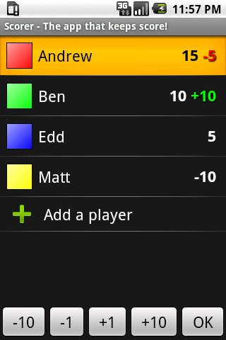
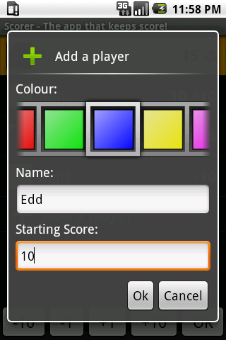

  <a href="https://play.google.com/store/apps/details?id=net.bramp.scorer"> Download Me</a>

Track the score of any number of players with this simple to use application. Great for card and board games such as Scrabble, Magic, Carcassonne, etc.

Features:

  * Unlimited players.
  * Easy to use.
  * Assign colours to players.
  * Randomise order or colours.
  * Keeps players and scores.
  * Free!

If you love or hate this app, or have any suggestions then feel free to [contact me][1].

### Screenshots

  
  &nbsp;&nbsp;
  

### Versions

  * 2010-04-07 
      * Add options page 
          * Move to next player after OK
          * Show/Hide totals row
          * Set values of each button
      * Display two more +/- buttons when in Landscape
      * Move players up and down
      * Sort by name, or score
      * Minor other changes
  * 2010-03-09 
      * French Translation
      * US Translation ;)
      * Added a totals row
      * Minor UI tweaks
  * 2010-03-07 
      * Fixed minor crash
      * Buttons disable when they can&#8217;t be pressed
  * 2010-03-06 &#8211; First Release

### TODO

  * Chart the scores over time.

### Credits

The software was written by Andrew Brampton. The scorer icon was taken from [FatCow][2]. The French translation was done by Vevert.

 [1]: 
 [2]: http://www.fatcow.com/free-icons/
