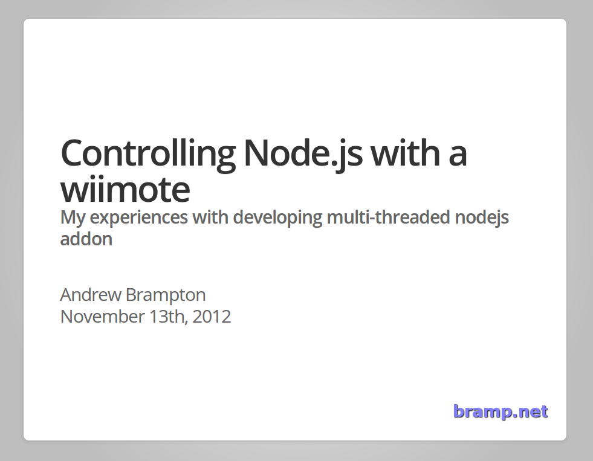

Last night I gave a short talk at [NodeDC][1], on how to use Node.js with a wiimote. The offical title was &#8220;Controlling Node.js with a wiimote &#8211; My experiences with developing multi-threaded nodejs addon&#8221;. I&#8217;d like to thank the NodeDC guys for arranging everything last night, it was a great night, with some great talks.

    

The slides can be found here: [https://bramp.github.io/nodewii-talk/][2]

 [1]: http://nodedc.github.com/
 [2]: https://bramp.github.io/nodewii-talk/
 
