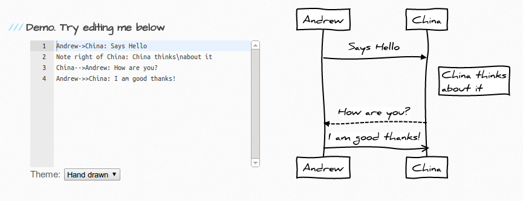

I&#8217;m happy to announce one of my projects, [js-sequence-diagrams][1]. This uses Javascript to draw UML sequence diagrams in SVG format. Here is an example:

<div class="text-center">
    <a href="https://bramp.github.io/js-sequence-diagrams/">
		
	</a>
</div>

You can alter the diagram in real time, and I even have a simple jQuery plugin to make this easy to use on your own sites.

```html
&lt;script src="sequence-diagram-min.js"&gt;&lt;/script&gt;
&lt;div class="diagram"&gt;A-&gt;B: Message&lt;/div&gt;
&lt;script&gt;
$(".diagram").sequenceDiagram({theme: &#39;hand&#39;});
&lt;/script&gt;
```

 [1]: https://bramp.github.io/js-sequence-diagrams/
 
