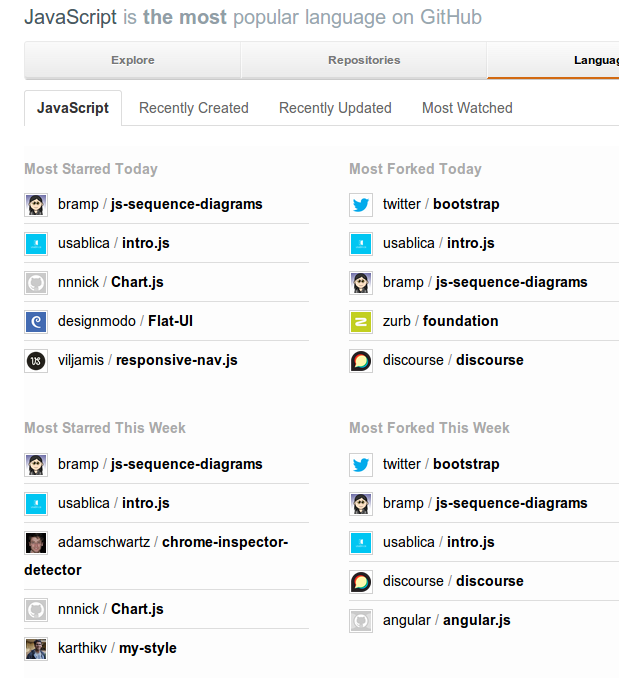

After getting my [js-sequence-diagrams][1] project onto [Hacker News][2], the popularity has gone viral.

    

 [1]: https://bramp.github.io/js-sequence-diagrams/
 [2]: https://news.ycombinator.com/item?id=5432110
 
