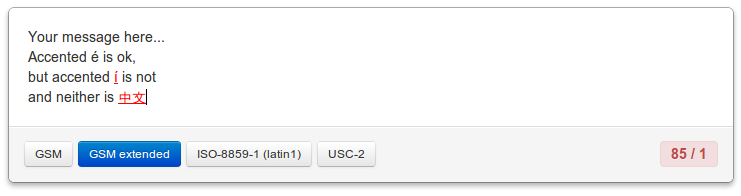

It is commonly known that Twitter allows 140 character messages, and some will tell you that a single SMS message is limited to 160 characters. However, it&#8217;s not as simple as that. In the US a single SMS message can contain 140 bytes of data, which if using [GSM encoding][1], we can squeeze up to 160 7-bit characters. Those 7-bit GSM characters don&#8217;t match up with normal ASCII characters, and even worse, not all characters take 7 bits, some take up 14 bits (for example the { character)!

When we start talking about messaging in non-latin scripts, such as Chinese, then a different encoding must be used. In the SMS world the encoding of choice is [UCS-2][2], which uses 16 bits per character. This limits a single part message to 70 characters (down from 160).

On top of that, most SMS clients will let you send concatenated SMS messages. That is, multiple message parts that appear as one long SMS message. A two part message allow up to 304 characters, not the 320 (160&#215;2) you might expect. This is due to the overhead required to store meta data about each part.

This all makes it very hard to count how long a SMS message will be, what characters are allowed, and how many parts it will take. To help with these isuses, I&#8217;ve created this simple tool which allows you to type out your message, and see how well it&#8217;ll fit

<a href="https:/blog.bramp.net/sms/">
 
https:/blog.bramp.net/sms/</a>

 [1]: http://en.wikipedia.org/wiki/GSM_03.38
 [2]: http://en.wikipedia.org/wiki/UTF-16
 
