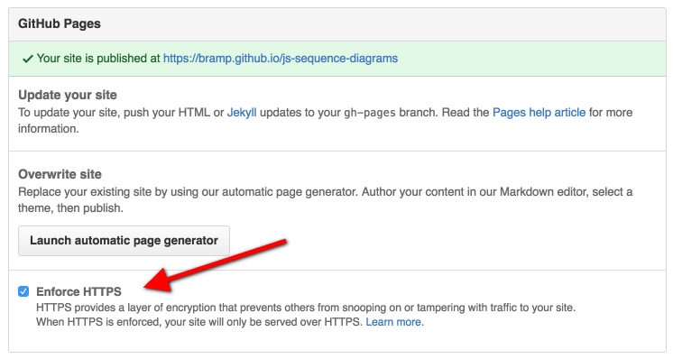

GitHub just [announced](https://github.com/blog/2186-https-for-github-pages) that all github.io sites can enforce the use of HTTPS. Previously GitHub supported HTTPS on these sites, but you couldn't force users to use HTTPS other than using a [javascript redirect hack](https://gist.github.com/konklone/9968713), or putting a CDN infront of GitHub. Now by checking a single box you can force users to the secure version:

</img>

Sadly I have far too many repositories, and I don't recall which one uses pages. I figured it would be easy to hit [GitHub's API](https://developer.github.com/v3/) and enabled this. The API doesn't directly support enabling HTTPS, so instead I wrote a quick script to list all repos with GitHub pages:

```python
#!/usr/bin/env python
# Prints a list of all owned repositories with pages.
# by Andrew Brampton 2016 https://bramp.net
#
import requests

headers = {'Authorization': 'token XXXXX'} # Replace XXXX with a token from https://github.com/settings/tokens
params = {'type': 'owner', 'page': 1}

while True:
	r = requests.get('https://api.github.com/user/repos', params=params, headers=headers)
	repos = r.json()
	if not repos:
		break

	for repo in repos:
		if repo['has_pages']:
			print "%32s %s/settings" %(repo['name'], repo['html_url'])

	params['page'] += 1
```
Download [turn-on-github-ssl.py](turn-on-github-ssl.py)

This print out something like so:

```bash
$ ./turn-on-github-ssl.py

                blog https://github.com/bramp/blog/settings
  ffmpeg-cli-wrapper https://github.com/bramp/ffmpeg-cli-wrapper/settings
js-sequence-diagrams https://github.com/bramp/js-sequence-diagrams/settings
           js-sudoku https://github.com/bramp/js-sudoku/settings
        nodewii-talk https://github.com/bramp/nodewii-talk/settings
             prob.js https://github.com/bramp/prob.js/settings
                test https://github.com/bramp/test/settings
              unsafe https://github.com/bramp/unsafe/settings
...
```

Now click on each URL, and just check the box. 