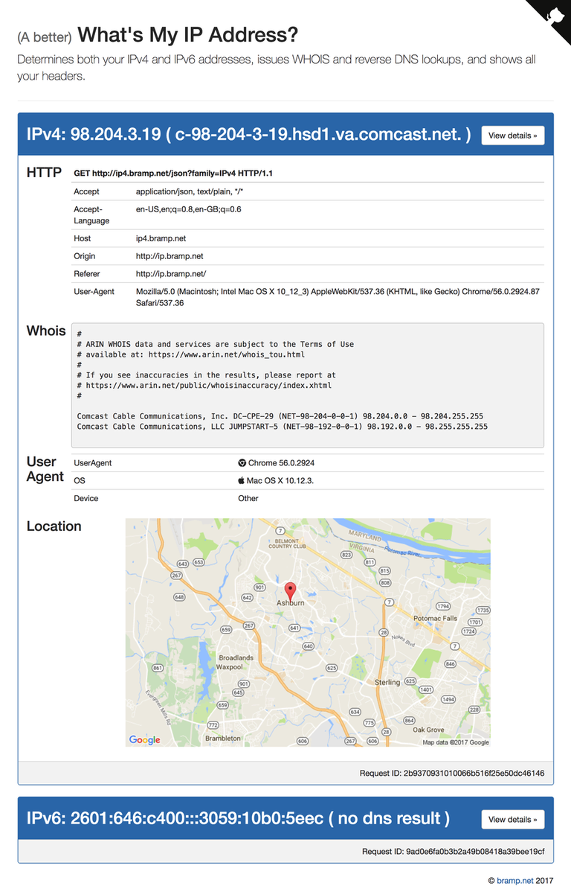
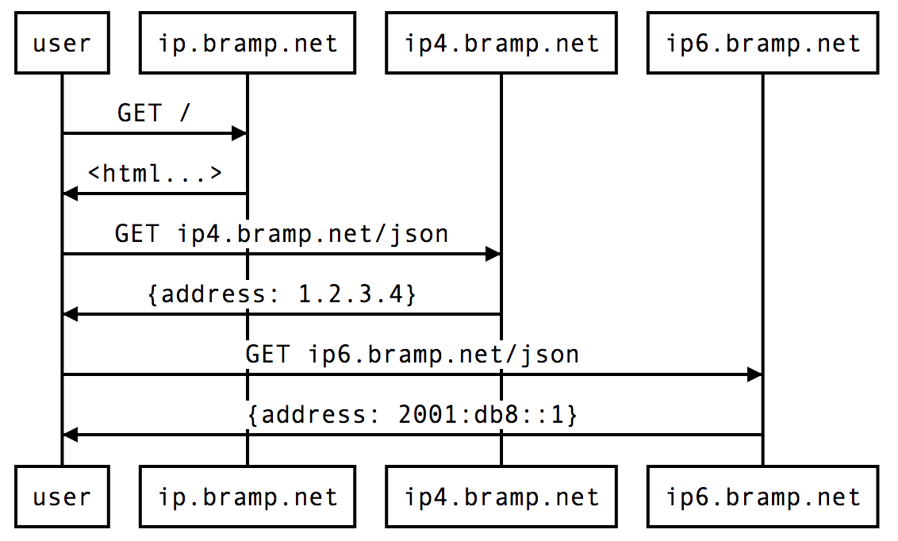

Occasionally I’m curious to know what network my device is using, if it has a IPv6 address, and who owns the address space. For example, when in a coffee shop I’m curious to know their ISP, or when roaming internationally I’m always curious to understand which mobile operator’s IP address gets assigned to device.

Most "[What’s my IP address](https://www.google.com/search?q=What’s+my+IP+address)" sites, will either only show you one of your IPv4, or IPv6. It won’t do a DNS lookup, and they rarely do a WHOIS lookup.  Doing all these things, shouldn’t be too hard, so I figured in a weekend I could hack together a site to do this.

This blog post explains the creation of [ip.bramp.net](http://ip.bramp.net).

<div class="text-center">
  </img>
</div>

## How to get both IPv4 and IPv6 address?

When navigating to a website your browser makes a connection, normally over one of IPv4, or IPv6. Which one is based on the DNS records available for the website’s domain, and the preference of your OS and browser. Thus your web server sees a single incoming connection, with a single remote address. This address is typically stored in a variable named REMOTE_ADDR. Most "What’s my IP" sites then display this variable back to the user as their IP address. However, as I’d like to see both IPv4 and IPv6 addresses, I need to somehow force the browser to make two requests, one over each.

There is no API to tell a browser to use IPv6 over IPv4, however, I use a trick with two domain names. Namely, I have ip4.bramp.net, and ip6.bramp.net. Both resolve to the same web server, but the former only has [DNS A records](https://tools.ietf.org/html/rfc1035), and the latter only [DNS AAAA records](https://tools.ietf.org/html/rfc3596). For example:

```bash
$ dig ip4.bramp.net
ip4.bramp.net.		300	IN	A	216.239.32.21

$ dig AAAA ip6.bramp.net
ip6.bramp.net.		291	IN	AAAA	2001:4860:4802:32::15
```

This forces the connection to be over either IPv4, or IPv6. If a browser doesn’t support IPv6, then the connection is never made, and an error is returned. Interesting side note, some browsers uses a technique called [Happy Eyeballs](https://en.wikipedia.org/wiki/Happy_Eyeballs), which tries to connect over both concurrently, but abandons the slower or worse behaving of the two connections.

## How do you make two requests from one page?

To force the site to make requests to both of these domains, I issue two [AJAX](https://en.wikipedia.org/wiki/Ajax_(programming)) queries. The typical flow looks like:

<div class="text-center">
  <object data="diagram.svg" type="image/svg+xml" height="364" width="583" alt="diagram of AJAX calls">
    
  </object>
</div>

<!--
```
user->ip.bramp.net: GET /
ip.bramp.net->user: <html...>
user->ip4.bramp.net: GET ip4.bramp.net/json
ip4.bramp.net->user: {address: 1.2.3.4}
user->ip6.bramp.net: GET ip6.bramp.net/json
ip6.bramp.net->user: {address: 2001:db8::1}
```
-->

These AJAX queries return a simple JSON object, containing information about the requesting user. In my application an example response may look like:

```json
{
  "RemoteAddrFamily": "IPv6",
  "RemoteAddr":       "2601:646:c200:b466:b446:ff32:b227:a53c"
}
```

This response can then be used to update the page, to display the appropriate address.

An experienced reader may be aware of some security issues with making AJAX request to a different domain. In particular, there are subtle ways in which a malicious site could abuse your AJAX endpoints. This is easily fixed by using cross-origin resource sharing ([CORS](https://en.wikipedia.org/wiki/Cross-origin_resource_sharing)) headers, in particular ip4.bramp.net, and ip6.bramp.net return the following:

```bash
$ curl -v ip4.bramp.net/json

< HTTP/1.1 200 OK
< Content-Type: application/json
< Access-Control-Allow-Origin: http://ip.bramp.net
```

The last header, explicitly allows requests from ip.bramp.net only, and thus forbids requests from other sites. Without this header, the AJAX request would be issued, but then rejected by the browser.

## What about the reverse DNS and WHOIS?

I noted I wanted to display both the reverse DNS, and WHOIS records. This is something the browser doesn’t support, but the server side could. Thus as part of processing the /json AJAX request, the application makes various additional requests to remote DNS and WHOIS servers.

To reverse lookup a IP address, you need to issue a [PTR DNS request](https://tools.ietf.org/html/rfc1035). This is a special DNS request which requires the IP address to be formatted as a in-addr.arpa or ip6.arpa name. For example, the IP address 1.2.3.4, would become 4.3.2.1.in-addr.arpa. Then when a request is sent for that in-addr.arpa. name, the reverse DNS is returned.

```bash
$ dig PTR 4.3.2.1.in-addr.arpa.

4.3.2.1.in-addr.arpa.	74312	IN	PTR	c-1-2-3-4.example.com.
```

The in-addr.arpa transformation, and lookup is commonly provided by [getaddrinfo(3)](https://linux.die.net/man/3/getaddrinfo) function, which makes this easy to do.

The WHOIS lookup is a little bit more complex. Each domain is represented by a different WHOIS server, that can be determined by the ccTLD or TLD of the domain. However, with IP addresses, you must identify the Regional Internet Registry ([RIR](https://en.wikipedia.org/wiki/Regional_Internet_registry)) that owns the IP space. Sadly there is not a trivial mapping, so instead I issue a WHOIS query to the Internet Assigned Numbers Authority ([IANA](https://en.wikipedia.org/wiki/Internet_Assigned_Numbers_Authority)), who replies with the RIR which owns the IP address. From there, I can query the correct registry directly, typically one of [AFRINIC](https://en.wikipedia.org/wiki/AFRINIC), [ARIN](https://en.wikipedia.org/wiki/American_Registry_for_Internet_Numbers), [APNIC](https://en.wikipedia.org/wiki/Asia-Pacific_Network_Information_Centre), [LACNIC](https://en.wikipedia.org/wiki/Latin_America_and_Caribbean_Network_Information_Centre), or [RIPE NCC](https://en.wikipedia.org/wiki/R%C3%A9seaux_IP_Europ%C3%A9ens_Network_Coordination_Centre). Thus a typical WHOIS request looks like this:

```bash
$ whois -h whois.iana.org 1.2.3.4

% IANA WHOIS server
% for more information on IANA, visit http://www.iana.org
% This query returned 1 object
refer:        whois.apnic.net
inetnum:      1.0.0.0 - 1.255.255.255
organisation: APNIC
status:       ALLOCATED
whois:        whois.apnic.net
changed:      2010-01
source:       IANA
```

```bash
$ whois -h whois.apnic.net 1.2.3.4

% [whois.apnic.net]
% Whois data copyright terms    http://www.apnic.net/db/dbcopyright.html
% Information related to '1.2.3.0 - 1.2.3.255'
inetnum:        1.2.3.0 - 1.2.3.255
netname:        Example-prefix
descr:          APNIC Example Project

...

% This query was served by the APNIC Whois Service version 1.69.1-APNICv1r0
```

Both the reverse DNS and WHOIS response is returned as part of the AJAX JSON response.

```json
{
  "RemoteAddrFamily":  "IPv4",
  "RemoteAddr":        "1.2.3.4",
  "RemoteAddrReverse": "c-1-2-3-4.example.com.",
  "RemoteAddrWhois":   "
    % IANA WHOIS server
    % for more information on IANA, visit http://www.iana.org
    % This query returned 1 object
    refer:        whois.apnic.net
    inetnum:      1.0.0.0 - 1.255.255.255
    organisation: APNIC
    status:       ALLOCATED
    ...
  "
}
```

## What about proxies?

Many users are behind proxies, which connects to the webserver on the user’s behalf. Thus the REMOTE_ADDR is the address of the proxy, not the actual user.  Some proxies have a workaround for this, by placing the user’s real IP address in the [X-Forwarded-For](https://en.wikipedia.org/wiki/X-Forwarded-For) (XFF), or newer [Forwarded](https://tools.ietf.org/html/rfc7239) HTTP header. However, these headers are easily set by the user, so can not be trusted. Thus for the moment I ignore these headers, and will instead display the proxy’s IP address. It is conceivable to create a whitelist of proxies, that I would trust the XFF header, but for now I didn’t want that headache. Especially since the server side issues requests to external hosts, if I trusted the XFF header, an abusive user could use my site as a proxy, or even use my site as a relay to [denial of service](https://en.wikipedia.org/wiki/Denial-of-service_attack) these remote servers.

## Tying this all together

Server side I use [App Engine](https://cloud.google.com/appengine/), and [Go](https://golang.org/). Why? Because I wanted to play with App Engine, and I’m a fan of Go right now. On the client side I use [Bootstrap](http://getbootstrap.com) to make the page look nice, and [AngularJS](https://angularjs.org). AngularJS because I’m familiar with it, and because it is really easy to issue an AJAX requests and transform the result into a web page.

I like App Engine, because of the [PaaS](https://en.wikipedia.org/wiki/Platform_as_a_service) model. It keeps my costs down, and I don’t need to setup a virtual machine, or create docker images. Instead I just write a single binary and upload it. However, App Engine does place some restrictions on what I can do, in particular limiting outbound connections to ones made via its own library. Thus I had to jump through a few hoops to make the reverse DNS and WHOIS requests. Instead of using [getaddrinfo(3)](https://linux.die.net/man/3/getaddrinfo), I had to issue DNS requests myself using App Engine’s socket library and my own UDP packets on port 53. Luckily the Go DNS library, [miekg/dns](https://github.com/miekg/dns), makes this relatively easy.  Similarly I had to implement the WHOIS lookup by hand, but again aided by a library, this time [domainr/whois](https://github.com/domainr/whois).

In conclusion, though the use of multiple domain names, some AJAX queries, and server side support. I was able to make "(a better) What's My IP Address?" site in under a weekend.

Check out the [full source on github](https://github.com/bramp/myip), or view the site at [ip.bramp.net](http://ip.bramp.net/)

