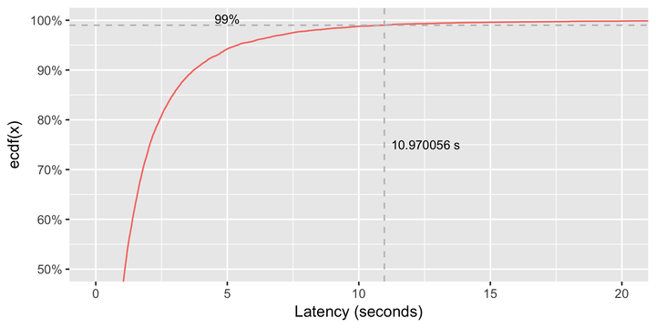
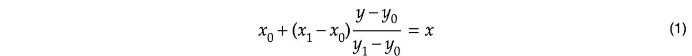
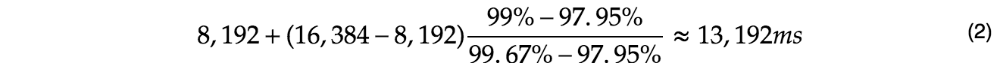
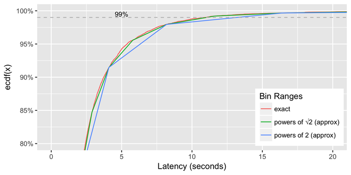

In many applications it is common to measure the time it takes to handle some event. Web applications pay close attention to this, to ensure each user’s request is replied to in a timely manner. To view in aggregate, many would just measure the mean response time. Which is easily calculated by summing up the total time to handle all requests, divided by the number of request. This average latency metric, however can be very [misleading](https://www.elastic.co/blog/averages-can-dangerous-use-percentile) as it does not show the worst case behaviour. For example, the majority of users may see requests handled quickly, but a few users may experience long delays. Thus to capture the worst behaviour it is better to look at percentile latency.

This article will discuss how to calculate percentiles, collect and aggregate in an distributed way, and even how to efficiently store them as time series data.

# Percentiles

Let's start with some basics, the 99 percentile, is defined as the value that 99 out of 100 samples fall below. Thus 99 users out of 100, observe a latency less than this value, and 1 in every 100 observe a latency equal to or greater. We choose the 99%tile, because it represents the [tail of the latency distribution](https://en.wikipedia.org/wiki/Long_tail) (that is the worst cases).

The simplest way to calculate the 99 percentile, is to sort all the values, and take the 99/100th value. For example, if you had 1,000 latency values, place them into an array, sort them, then take the value at the 990th index. That’ll be the 99%tile, which represents the latency value that 99% of the values are less than. Easy.

Throughout this article I’ll use a dataset of [10,000 randomly generated values](https://docs.google.com/spreadsheets/d/1s7-DbMeHTyzEZdeBaM5rrKp5o0V9O11VFX9Y47or150/edit#gid=884072054) from a [log-normal distribution](https://en.wikipedia.org/wiki/Log-normal_distribution) with parameters (μ = 0, σ = 1). Most of the values will be small (<2s), but there will be a long tail, which will simulate worst case latencies returned by a server.

  <object data="1st.svg" type="image/svg+xml" width=720 height=360 alt="eCDF of example dataset">
    
  </object>

Above we have a [empirical cumulative distribution function](https://en.wikipedia.org/wiki/Empirical_distribution_function) (eCDF), which visually demonstrates this technique. On the redline there are 10,000 latency values, in sorted order. If we take the 9,900th point, we see a value of 10.97 seconds. This is the 99%tile latency for our dataset.

We could use this simple approach to calculate the distribution on our servers. However, let's assume our servers receive 100 queries per second (qps), and we want to calculate the 99%tile every 60 seconds. That’ll require us to store 6,000 latency values for every minute, which is a doable, but unbounded. If we extend this to a dozen servers, all storing 6,000 numbers every minute, and we wanted to aggregate this metric across all of them, this could very quickly get out of control. Especially if we are capturing multiple different dimensions of this metrics (e.g percentiles for successful vs failed requests).  Perhaps there is a way to approximate this, bounding the amount of RAM, while keeping a level of accuracy.

# Histogram Approximation

Instead of storing each number, we could bin them into groups, in the same way a histogram would. For example, we know that latency values will be in the range 0 to 60,000ms. That’s because, it is impossible to handle the request in zero seconds, and hopefully the application will timeout after 60 seconds (otherwise the chances are the user isn’t waiting anymore).

So we can use histogram bins that double in size from 1ms, to ~64,000ms, for example (0-1ms], (1-2ms], (2-4ms], (4-8ms], (8-16ms], (16-32ms], (32-64ms], (64-128ms], (128-256ms], (256-512ms], (512-1024ms], etc. Extending to 65,536ms (2^16), would give us 18 bins. Each bin will record the count of values that land within its range. Thus we only need to store 18 counts, instead of the unbounded 6,000 latency values.

But how well does this approximate? Lets look at our random dataset from earlier.

<!--
| Bin Range (ms)  | Count | Running total | eCDF(x) |
|----------------:|------:|--------------:|--------:|
|  1,024 |  2,048 | 2,842 |         7,490 |  74.90% |
|  2,048 |  4,096 | 1,657 |         9,147 |  91.47% |
|  4,096 |  8,192 |   648 |         9,795 |  97.95% |
|  8,192 | 16,384 |   172 |         9,967 |  99.67% |
| 16,384 | 32,768 |    29 |         9,996 |  99.96% |
-->

<table class="table">
<thead>
<tr>
<th class="text-center" colspan=2>Bin Range (ms)</th>
<th class="text-right">Count</th>
<th class="text-right">Running total</th>
<th class="text-right">eCDF(x)</th>
</tr>
</thead>

<tbody>

<tr>
<td class="text-center" colspan=5> ... 12 rows cut ... </td>
</tr>

<tr>
<td class="text-right">1,024</td>
<td class="text-right">2,048</td>
<td class="text-right">2,842</td>
<td class="text-right">7,490</td>
<td class="text-right">74.90%</td>
</tr>

<tr>
<td class="text-right">2,048</td>
<td class="text-right">4,096</td>
<td class="text-right">1,657</td>
<td class="text-right">9,147</td>
<td class="text-right">91.47%</td>
</tr>

<tr>
<td class="text-right">4,096</td>
<td class="text-right">8,192</td>
<td class="text-right">648</td>
<td class="text-right">9,795</td>
<td class="text-right">97.95%</td>
</tr>

<tr>
<td class="text-right">8,192</td>
<td class="text-right">16,384</td>
<td class="text-right">172</td>
<td class="text-right">9,967</td>
<td class="text-right">99.67%</td>
</tr>

<tr>
<td class="text-right">16,384</td>
<td class="text-right">32,768</td>
<td class="text-right">29</td>
<td class="text-right">9,996</td>
<td class="text-right">99.96%</td>
</tr>
</tbody>
</table>

In this table, the first two columns represent the range of the bin, and the third column is the count of values within that bin. The running total column, is the sum of the current bin and all previous bins. Finally, the eCDF(x) is the empirical cumulative distribution function, or simply put, the running total divided by the sum of all counts (which in this case is 10,000 as there are exactly 10,000 samples).

The bins can accurately determine the percentiles at the edges, so for example, the 97.95%tile is 8,192ms, and the 99.67%tile is 16,384ms. However, we wanted the 99%tile, which lies somewhere between these two values. We can use [linear approximation](https://en.wikipedia.org/wiki/Linear_interpolation) to find the position in the bin (which is somewhere above 8192ms, but less than 16,384ms).

<!-- https://www.mathcha.io/editor -->

  <!-- x_{0} + (x_{1} - x_{0}) \frac{y - y_{0}}{y_{1} - y_{0}} = x -->
  </img>
   

 

  <!-- 8,192 + (16,384 - 8,192) \frac{99\% - 97.95\%}{99.67\% - 97.95\%} \approx 13,192 ms -->
  </img>

 

Thus we can determines the 99%tile is 13.192 seconds. If we compare this to non-approximate value from earlier, 10.970s, we seem to be off by ~20%. To make this approximation more precise, we can increase the number of bins. Instead of doubling the bin boundaries, we can increase each boundary by a factor of √2 (square root of 2). This would double the number of bins (from 18 to 36), but increase the precision greatly. If we use these new bins, the linear approximation gets us a value of 11.042s (at the 99%tile) which is only off by 0.66%. This seems a good trade-off of space and accuracy.

  <object data="2nd.svg" type="image/svg+xml" width=720 height=360 alt="eCDF of example dataset with linear approximation">
    
  </object>

Just to double-check, calculating the 99.9%tile (one additional 9) exactly is 23.105s, and the √2 bins estimates is 23.170s. This is only off by 0.28%, so again seems reasonable. Obviously, the shape of the distribution, and the actual values will affect the error. Empirically √2 bins works well enough, but your experience may vary.

# Aggregation

Now we can calculate the percentiles, how would we extend this so we can aggregate the percentiles from multiple servers. A naive approach may be to ask each server to calculate its own 99%tile, and for us to calculate a mean of these. A average of percentiles doesn’t seem ideal, especially if one server is particularly bad, a average may just hide the outliers again. A better approach, is to collect the histogram (set of bins) from each server, and simply add them together. This works easily if every server is using the same bin ranges.

<!--
| Bin Range (ms) | Server A Count | Server B Count | Total Count |
|----------------|---------------:|---------------:|------------:|
| <td colspan=5> ... </td> |
|  1,024 |  2,048 | 2,842 | 2,811 | 5,653 |
|  2,048 |  4,096 | 1,657 | 1,660 | 3,317 |
|  4,096 |  8,192 |   648 |   634 | 1,282 |
|  8,192 | 16,384 |   172 |   155 |   327 |
<td colspan=5> ... </td>
-->

<table class="table">
<thead>
<tr>
<th class="text-center" colspan=2>Bin Range (ms)</th>
<th class="text-right">Server A Count</th>
<th class="text-right">Server B Count</th>
<th class="text-right">Total Count</th>
</tr>
</thead>

<tbody>
<tr>
<td class="text-center" colspan="5"> ... </td>
</tr>

<tr>
<td>1,024</td>
<td class="text-right">2,048</td>
<td class="text-right">2,842</td>
<td class="text-right">2,811</td>
<td class="text-right">5,653</td>
</tr>

<tr>
<td>2,048</td>
<td class="text-right">4,096</td>
<td class="text-right">1,657</td>
<td class="text-right">1,660</td>
<td class="text-right">3,317</td>
</tr>

<tr>
<td>4,096</td>
<td class="text-right">8,192</td>
<td class="text-right">648</td>
<td class="text-right">634</td>
<td class="text-right">1,282</td>
</tr>

<tr>
<td>8,192</td>
<td class="text-right">16,384</td>
<td class="text-right">172</td>
<td class="text-right">155</td>
<td class="text-right">327</td>
</tr>
</tbody>
</table>

So in this example, Server A and Server B have 2,842 and 2,811 samples respectively between 1.024s and 2.048s. Meaning across both these servers, there were 5,653 requests that took between 1 and 2 seconds. Using the same linear approximation techniques on this combined histogram allows us to calculate the aggregated percentiles.

This kind of aggregation works well, and is lightweight enough to collect across even a large fleet of servers. Then in a centralised location (perhaps the machine doing the monitoring) the aggregate percentiles can be calculated. If needed per server percentiles can be drilled down, as that data is retained. A lot simpler than maintaining the full set (10,000) values from each server.

# Time

Typically, these percentiles want to be measured over time. For example, we want to know the 99%tile aggregated across all the servers for every minute, or hour of the day. To achieve this we need to store the histogram at fixed intervals, say every minute. There is again a naive approach, where every minute we reset the histogram counts to zero. Allowing each server to only be counting the values in the last minute. Conceptuation this is easy to reason about, but introduces subtle synchronisation issues. What happens if each server has a slightly different definition of when a minute starts? or that collection is delayed and histograms are not aggregated (before being reset)?

A more robust way is to never reset the histogram, but to always keep increasing counts. Then to calculate the value for a particular interval (say the last minute), you subtract the most recent histogram from the previous minute’s histogram. This is a little bit more work, but a lot more flexible.

To explore this concept, lets begin with a simpler (non-histogram) example, say calculating requests per second. If we store a running counter of requests, then if you recall your calculus, the rate per second, is the differential. That is, the delta between two values.



| Time (s) | Running Count | Delta (per minute) |
|---------:|--------------:|-------------------:|
|        0 |             0 |                    |
|       60 |            95 |                 95 |
|      120 |           205 |                110 |
|      180 |           310 |                105 |
|      240 |           395 |                 85 |
|      300 |           450 |                 55 |
|      360 |           480 |                 30 |
|      420 |           500 |                 20 |
|      480 |           500 |                  0 |
|      540 |           590 |                 90 |
|      600 |           700 |                110 |



Taking the example above, we can say the average requests per seconds between time 120s, and 180s is 1.75. Because at time 180s there were 310 total requests, and at time 120s there were only 205. Thus a delta of 105 requests per minutes, or 1.75 requests per second.

This has the nice property, that we can easily calculate the rate over any arbitrary interval. For example, subtracting the value at time 600s, with the value at time 0s, calculates the average rate over the last 10 minutes.  This is a lot simpler than keeping track of the per second rate every minute, and calculating the average of them. This property is especially useful when plotting on a graph where each pixel may represent a wide interval (such as a full hour). Having a quick way to calculate the rate in that hour is a real performance win.
Even though this example was a simple rate per second, this works exactly the same for the histograms. Thus, storing the running total, across all servers, at periodic intervals, we can easily calculate an approximate percentile over any arbitrary interval.

# Conclusion

To truly understand latency, the distribution of it must be examined. This can be achieved by looking at various percentiles. These percentiles can be scalably and efficiently calculated by using histograms with fixed bins, which keep track of a running count of latency values.

A quick word of warning, all monitoring lies to you in subtle ways, and it is your responsibility to understand it. If you have fewer than 100 values, does a 99%tile metric make sense? Perhaps extend the collection interval over a longer time period, or instead use the 90%tile.  A single percentile also doesn’t show the full picture, it may always be worth exporting the 50%, 90%, 99%tile, etc. Or perhaps, a percentile doesn’t capture your monitoring requirements, and instead simply taking the max value would be better. 

Finally, you may not wish to calculate all this yourself, and instead use a off the shelf library, such as [HdrHistogram](https://hdrhistogram.github.io/HdrHistogram/), or a monitoring solution such as [Prometheus](https://prometheus.io).
