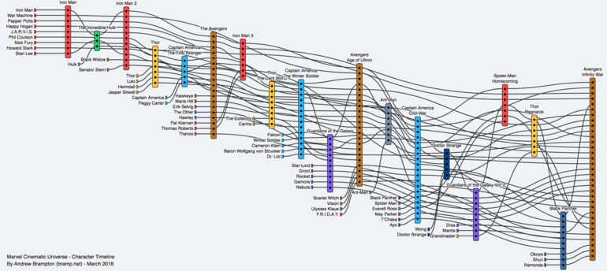
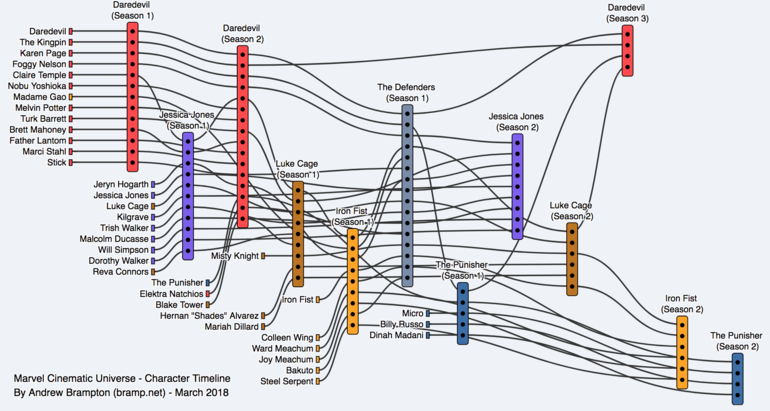

In the run up to the [third Avengers movie](https://www.imdb.com/title/tt4154756/), I was wondering which characters have appeared together, and when. With dozens of characters across eighteen [Marvel Cinematic Universe](https://en.wikipedia.org/wiki/Marvel_Cinematic_Universe) (MCU) movies, this will make Avengers Infinity War one huge mashup. In the style of the [XKCD narrative diagrams](https://xkcd.com/657/), I plotted out the journey each character has taken across the numerous movies. I also got carried away and created a similar (yet smaller) diagram for the [Netflix Marvel shows](https://en.wikipedia.org/wiki/List_of_Marvel_Cinematic_Universe_television_series#Netflix_series).

 

**Marvel Cinematic Universe - Iron Man (2008) though Avengers: Infinity War (2018)**

<a href="https://projects.bramp.net/mcu/film.html">
  </img>
  
click to open an interactive version

</a>

 

**Marvel Cinematic Universe - Netflix Shows**

<a href="https://projects.bramp.net/mcu/netflix.html">
  </img>
  
click to open an interactive version

</a>

I would like to thank the contributors to [marvel-movies.wikia.com](http://marvel-movies.wikia.com/) where I got all the information. As well as [Simon Elvery](https://twitter.com/drzax) who created the [d3-layout-narrative](https://github.com/abcnews/d3-layout-narrative) module for [d3.js](https://d3js.org/) that made these diagrams easier to create. Check back in future when I write up an article on how I created these diagrams. As always, I welcome feedback, you may contact me at [@TheBramp](https://twitter.com/TheBramp).

