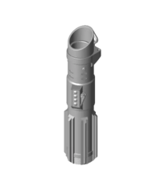
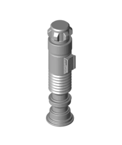
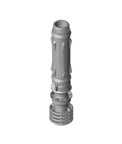

I came across these cool 3D printable Light Sabers by [3dprintingworld](https://thangs.com/designer/3dprintingworld), but I couldn't get the blade to print well. So here is a write up of my experience, and the modifications I made.

<!--
  convert saber-orig.jpg -resize 720x saber.jpg
  convert saber-on-orig.jpg -resize 720x saber-on.jpg
  convert saber-parts-orig.jpg -resize 720x saber-parts.jpg
-->




# Hilt

The hilt printed well, I used [Prusa Silver PLA](https://www.prusa3d.com/product/silver-pla-filament-1kg/), and nothing special needed to be done. There are many to pick from online:

<!-- Move this kind of thing into the main css -->

<!--
  convert saber-1-orig.webp -resize 200x saber-1.png
  convert saber-2-orig.webp -resize 200x saber-2.png
  convert saber-3-orig.webp -resize 200x saber-3.png
-->

  <figure class="background-2">
    <figcaption><h4>Darth Vadar</h4>
        <a href="https://www.thingiverse.com/thing:3668138">thingiverse</a> | 
        <a href="https://thangs.com/3dprintingworld/Collapsing-Sith-Lightsaber-23598">thangs.com</a>
      </figcaption>
  </figure>
  <figure class="background-1">
    <figcaption><h4>Return of the Jedi</h4>
        <a href="https://www.thingiverse.com/thing:3606120">thingiverse</a> | 
        <a href="https://thangs.com/designer/3dprintingworld/3d-model/Collapsing-LightsaberPNP-23596">thangs.com</a>
    </figcaption>
  </figure>
  <figure class="background-3">
    <figcaption><h4>Leia's</h4>
        <a href="https://thangs.com/designer/3dprintingworld/3d-model/Leia's%20Dual%20Extrusion%20Collapsing%20Lightsaber%20-25509">thangs.com</a>
    </figcaption>
  </figure>

There are slightly different versions of these files on thingiverse and thangs.com. The thingiverse versions seem to be the easiest to work with.

# Blade

<!--
ffmpeg -i "blade-extending-orig.mp4" -filter:v "crop=1920:360:0:360,scale=720:136" "blade-extending.mp4"
ffmpeg -i "blade-extending-orig.mp4" -filter:v "crop=1920:360:0:360,scale=720:136" "blade-extending.webm"
-->

<video width="720" height="136" loop muted autoplay>
  <source src="blade-extending.mp4" type="video/mp4" />
  <source src="blade-extending.webm" type="video/webm" />
  Your browser does not support the video tag.
</video>

The Collapsing Blade is where I had problems. These are sets of concentric telescoping tubes that taper inwards allowing them to fit within each other but not slide out all the way. 3dprintingworld offered two techniques, [print-in-place](https://thangs.com/designer/3dprintingworld/3d-model/SwordSaber-Test-Print-23601), and vase printing. The former would print the multiple tubes at the same time layer by layer. Whereas vase prints each tube individually as one continuous motion from top to bottom. The vase technique produced nicer looking blades, that were thinner yet strong. However, I couldn't get the [provided vase mode models](https://www.thingiverse.com/thing:3606120) to work, so I made my own in Fusion 360 (STL and Fusion files available here TODO).

The end result is ~110cm long, with five separate tubes. These are printed with 0.65mm extrusion width, and no top or bottom layers. I printed them all with the wider end of the tube as the base, but for the thinest one I found printing that upside down made for a cleaner end. I used [Overture Purple PETG](https://overture3d.com/products/overture-petg-3d-printer-filament-1?variant=42224802922750), which gave a very nice [Samuel L. Jackson lightsaber](https://www.giantfreakinrobot.com/scifi/samuel-jackson-claims-bad-motherfcker-star-wars-lightsaber.html).

<!--
convert blade-settings-1-orig.png -resize 720x blade-settings-1.png
convert blade-settings-2-orig.png -resize 528x blade-settings-2.png
-->





# Blade Cover

The blade fitted well, but I wanted to stop it falling out so I printed a snug fitting cover. Again this was printed in vase mode, but with a 0.55mm extrusion width, and 17 solid bottom layers (to fill up to the thin tube part). Again the STL and Fusion files available.

<!--
convert cap-orig.png -resize 300x cap.png
convert cap-orig.jpg -resize 300x cap.jpg
-->




<!--
convert cap-settings-orig.png -resize 710x cap-settings.png
-->



# Finished

* <b>Hilt</b> - Silver PLA - Normal Settings
  * [LIGHTSABER-CAP.stl](https://www.thingiverse.com/thing:3606120/files) and [LIGHTSABER-HILT.stl](https://www.thingiverse.com/thing:3606120/files).
* <b>Blade Cover</b> - Silver PLA - Vase Mode
  * [LightSaber_Cap_v12.stl](https://www.printables.com/model/161150/files)
* <b>Blade</b> - Purple PETG - Vase Mode
  * [LightSaber_Blade_v4_1.stl - LightSaber_Blade_v4_5.stl](https://www.printables.com/model/161151/files)
}

<!--
ffmpeg -i "saber-fun-orig.mp4" -filter:v "scale=720:406" "saber-fun.mp4"
ffmpeg -i "saber-fun-orig.mp4" -filter:v "scale=720:406" "saber-fun.webm"
-->

<figure>
<video width="720" height="406" loop muted autoplay>
  <source src="saber-fun.mp4" type="video/mp4" />
  <source src="saber-fun.webm" type="video/webm" />
  Your browser does not support the video tag.
</video>
 <figcaption><h4>Lightsaber in action</h4></figcaption>
</figure>
